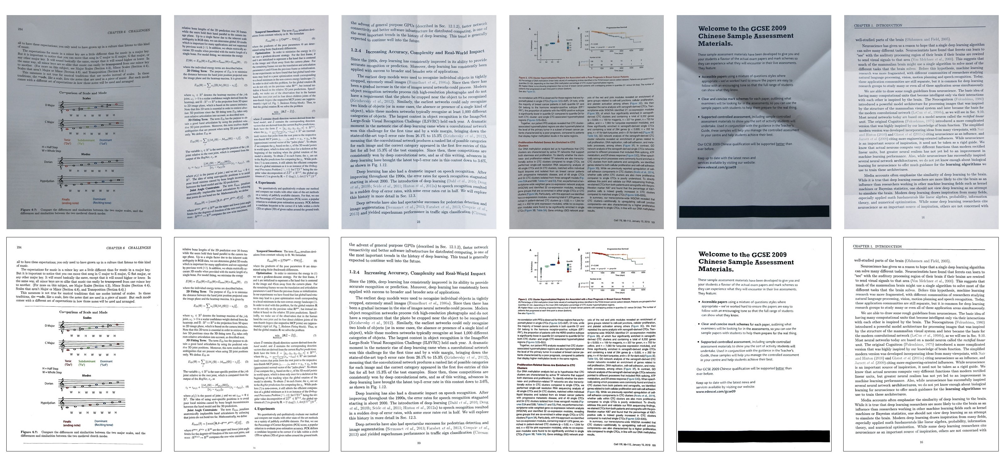
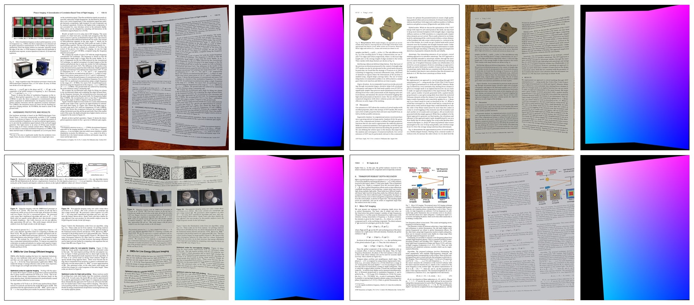

# DocProj

### [Paper](https://arxiv.org/abs/1909.09470)

The source code of Document Rectification and Illumination Correction using a Patch-based CNN by Xiaoyu Li, Bo Zhang, Jing Liao, Pedro V. Sander, SIGGRAPH Asia 2019.

 

## Prerequisites
- Linux or Windows
- Python 3
- CPU or NVIDIA GPU + CUDA CuDNN

## Geometric Rectification

### Dataset Generation
We use [Blender](https://www.blender.org/) to automatically generate synthetic distorted document image and the corresponding flow.

 

You can download a small dataset with 20 samples (438MB) from [here](https://drive.google.com/open?id=1b3kBs46ZSq5cWjvGdMjWNY854YaJ6dZ1) for fun and the full dataset with 2450 samples (65GB) from [BitTorrent](https://drive.google.com/open?id=1WkzMukIHS_smGPyjcyj7LIiWUk0RJriN) or from [OneDrive](https://hkustconnect-my.sharepoint.com/:f:/g/personal/xliea_connect_ust_hk/EsV9Q8s2g3ZNgwSYEfdnvTAB4_uIq8LEwXr1VcvaB0X8bw?e=cKtw5j).

The dataset includes three folders: 
- img (the distorted images, with the shape of [2400, 1800, 3])
- img_mask (the mask of background, with the shape of [2400, 1800])
- flow (the forward flow of the distorted images, with the shape of [2, 2400, 1800])

The first thing you need to do is to crop the dataset to patches for training. Change arguments to your own and run the following commands. For help message about optional arguments, run `python xxx.py --h`
```bash
python local_patch.py   # crop images and flows to local patches and local patch flows
python global_patch.py  # crop images to global patches
```

### Training
Run the following command for training and change the optional arguments like dataset directory, etc.
```bash
python train.py
```

### Use a Pre-trained Model
You can download the pre-trained model [here](https://drive.google.com/open?id=1EPmFYd7OwfUZBLkJQ9sO8G1r5tLniKDh).

Run the following command for resizing and cropping the test document image to local and global patches and estimating the patch flows:
```bash
python eval.py [--imgPath [PATH]] [--modelPath [PATH]]
               [--saveImgPath [PATH]] [--saveFlowPath [PATH]]
               
--imgPath             Path to input image
--modelPath           Path to pre-trained model
--saveImgPath         Path to saved cropped image
--saveFlowPath        Path to saved estimated flows
```

### Stitch flow
Download the Windows executable program [here](https://drive.google.com/open?id=1QI2v1oWgha0jdcVuj7mzOXpgjBULZ7Mg) to stitch the patch flows to get the image flow.

Run the following command:
```bash
Graphcut.exe [Input Path] [Output Path]
```
`[Input Path]`  is the path to input patch flows with the shape of \[yNum, xNum, 2, patchH, patchW\], where yNum and xNum are the number of patch in y and x direction, patchH and patchW are the height and width of a local patch.

`[Output Path]` is the path to the output stitched flow with the shape of \[2, H, W\].

Notes: The path should be absolute path with "//" due to the path parse function in the program. e.g. "H://Release//test data//2_patchFlows.npy"

### Resampling
Import `resampling.rectification` function to resample the distorted image by the stitched flow.

The distorted image should be a Numpy array with the shape of \[H, W, 3\] for a color image or \[H, W\] for a greyscale image, the stitched flow should be an array with the shape of \[2, H, W\].

The function will return the resulting image and a mask to indicate whether each pixel will converge within the maximum iteration.

**To help you follow all these steps, we also give an example with all the intermediate results [here](https://drive.google.com/open?id=1QI2v1oWgha0jdcVuj7mzOXpgjBULZ7Mg) in the test data folder.**

## Illumination Correction

### Training
Run the following command and change the optional arguments for training.
```bash
python train_illumination.py
```

### Use a Pre-trained Model
You can download the pre-trained illNet model [here](https://drive.google.com/open?id=1EPmFYd7OwfUZBLkJQ9sO8G1r5tLniKDh) and pre-trained vgg model [here](https://drive.google.com/open?id=18hHB-sYkEMBndzbL8LJO2uV1pXltghxJ).

Run the following command for testing:
```bash
python eval_illumination.py [--imgPath [PATH]] [--savPath [PATH]] [--modelPath [PATH]]
                            
--imgPath             Path to input image
--savPath             Path to saved output
--modelPath           Path to pre-trained model
```
